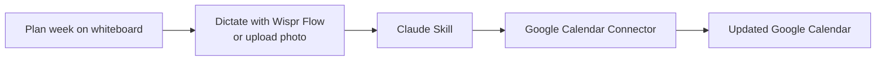

Every Sunday my wife and I stand in front of the whiteboard and plan our week.

We'll map out our lifting days, our runs, work commitments, and everything else we have going on. Once we're happy with it, that's our plan for the week.

The problem was that the whiteboard only lived in our office.

I still wanted my workouts on my phone so I could reference them throughout the week. Every Sunday I'd sit down afterward, recreate the workouts in Google Calendar, move events around, rename everything, and make sure it all landed on the right calendar.

It only took a few minutes, but it was one of those tasks that never really needed me to do it.

After enough Sundays doing exactly that, I realized I wasn't trying to automate Google Calendar. I was trying to automate the process.

If you've been using AI regularly, you've probably noticed something. You start asking it to do the same things over and over again. Maybe it's formatting meeting notes. Maybe it's planning meals. Maybe it's organizing your week. Whatever it is, you eventually find yourself repeating the same instructions every time you open a new chat.

That's where Claude Skills come in.

One of the biggest reasons I reach for Claude over ChatGPT for workflows like this is Skills. I use ChatGPT every day, but I find Skills much easier to build, organize, and refine over time. They feel less like saving a prompt and more like creating a reusable workflow.

A Skill is essentially a set of instructions that Claude automatically applies whenever you invoke it. Instead of explaining how I want my calendar updated every Sunday, I've already taught Claude how I like things done.

The biggest advantage isn't convenience. It's consistency. AI isn't deterministic. Ask the same question five different times and you'll often get five slightly different answers. That's useful when you're brainstorming, but it's not what I want from a workflow I repeat every week. The Skill provides the instructions. I only provide the context.

The Skill contains everything that rarely changes:

- Which Google Calendar to update.
- How workout events should be named.
- Which emojis belong in each workout.
- Default workout lengths.
- How to handle existing calendar events.
- Various formatting preferences I've accumulated over time.

Because all of that lives inside the Skill, the only thing I provide each week is the schedule itself: what week we're planning, which days we're working out, and which workouts belong on each day. Most weeks I don't even type anything. I'll either dictate the week's schedule using Wispr Flow or take a picture of the whiteboard and let Claude build the calendar from the image. Both produce essentially the same result.

One thing I didn't appreciate until I started building Skills is that they aren't static. They're living documentation, the same way documentation works at a software company: accurate when you write it, and stale the moment the system changes without it. Every few weeks I'll notice something I'd like to improve. Maybe I want different emojis. Maybe I'd rather schedule workouts on another calendar. Maybe I think of a better way to handle conflicts or format event names. Instead of correcting Claude every week, I update the Skill, and every small improvement compounds. Over time the workflow becomes more reliable, more predictable, and more tailored to exactly how I like to work.

I've mentioned Wispr Flow in a few posts now, but it's become one of my favorite AI tools. I use it at work. I use it on my phone. Whenever I have the option to dictate instead of type, I'm probably using Wispr. The advantage isn't really the voice dictation itself, it's that talking removes the friction of providing context. I can ramble, explain why I moved a workout, mention that we're traveling later in the week, include extra details I probably wouldn't bother typing. One of the biggest predictors of a good AI response is the quality of the context you provide, and talking is simply a much faster way to give Claude that context than typing ever is.

Building this workflow also changed the way I think about AI and SaaS products. A few years ago I probably would have used something like Reclaim to automate my calendar. Reclaim is a good product. Its entire job is intelligently interacting with Google Calendar. Today, Claude can do that directly. Through its Google Calendar connector, Claude connects to my calendar using OAuth, has permission to modify events, and understands what I want through natural language. Instead of paying for another service whose job is managing my calendar, Claude simply manages the calendar itself. It cuts out the middleman.

That doesn't mean I think SaaS products are going away. If anything, I think great software becomes even more valuable. Google Calendar is still an excellent calendar. Obsidian is still where I keep my notes. Hevy is still where I track my workouts. Those products exist because they've spent years refining their user experience, and I'm not interested in replacing them with AI. What I want is for AI to become the interface that interacts with them, so the applications stay the source of truth and AI just becomes another way of working with my own data. That's a very different goal than replacing every app with another AI application.

This has become one of the themes behind a lot of the systems I've been building recently. I don't want my information scattered across a dozen different AI tools. I want my notes to stay in Obsidian. I want my calendar events to stay in Google Calendar. I want my workouts to stay in Hevy. I want my tasks to stay in Todoist. I want AI to interact directly with those systems instead of creating another copy somewhere else. It's the same philosophy I wrote about in [[The Workout App I Could Finally Connect to AI|my post on connecting AI directly to Hevy]]: I'm much less interested in replacing software than I am in letting AI orchestrate the tools I already use.

To me, that's where connectors become really interesting. Instead of building new platforms, AI can work with the tools you already use and the data you already own. This workout scheduler just happens to be one example. It probably saves me five minutes every week. That's not really the point. The interesting part is what happened after I built it: I started noticing all the other repetitive workflows in my life. Every time I catch myself giving AI the same instructions twice, I stop and ask myself one question.

**Should this become a Skill instead?**

